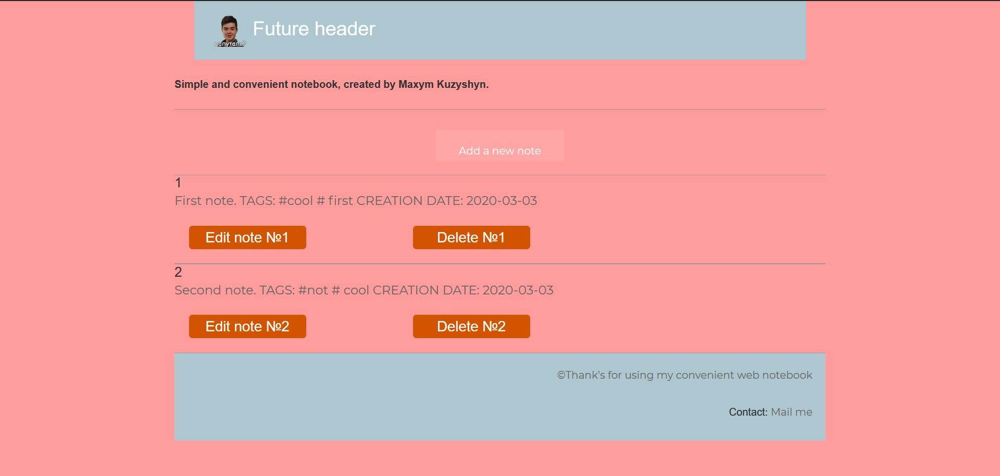
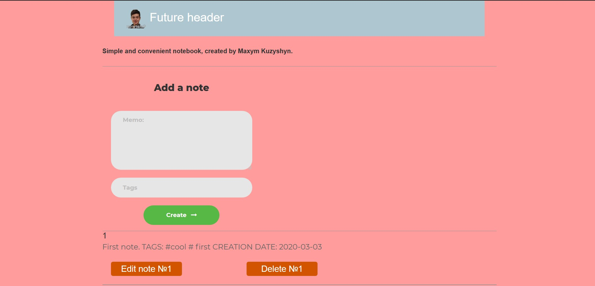

# Web-notebook

### This reository is written on Python programming language(Version 3.7+) to help people manage their daily tasks
## You can add, edit and delete any notes
___
## Site examples:
#### Home page

#### You can add, edit and delete your notes

